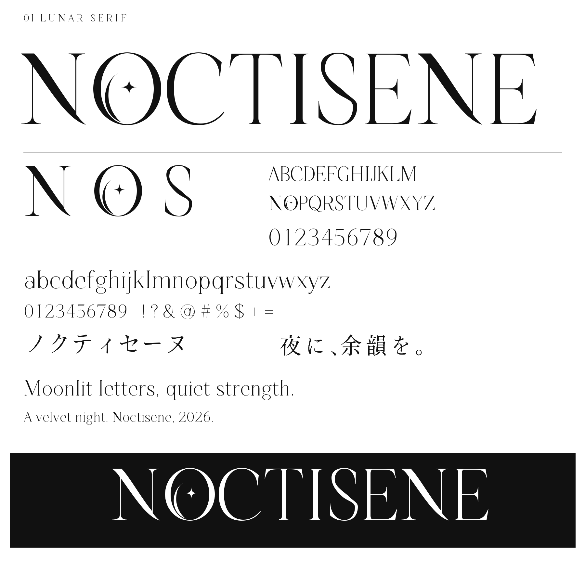

# LUNAR SERIF

NOCTISENEの、流れるN・三日月と四芒星のO・細長いSを持つフォントです。ロゴ用の **Display 1.002** と、広い日本語に対応する **JP 1.000** を収録しています。

Display版は独自欧文と、生成見本から再構成した和文14文字。JP版は独自欧文104文字をそのまま保ち、和文をOFLの「しっぽり明朝」から統合した派生フォントです。不足していた記号・半角カナ260文字をNoto Serif JPで補い、記号≒を独自の幾何輪郭で追加しています。JP版の和文すべてを新規制作したものではありません。

## 日本語版

- **[JP TTF](outputs/LUNARSERIFJP-Regular.ttf)** / **[JP WOFF2](outputs/LUNARSERIFJP-Regular.woff2)** / [同梱OFLライセンス](outputs/LUNAR-SERIF-JP-OFL.txt)
- **[日本語入力・横書き・縦書きプレビュー](japanese.html)** / [導入と使い方](docs/japanese-usage.md)
- [生成見本50文字との比較](verification/japanese/reference.html) / [スクリーンショット検証](verification/japanese/REPORT.md)
- [収録文字データ](outputs/japanese-coverage.json) / [採用基盤と出典](docs/japanese-basis.md)

15,624文字・16,730字形。JIS X 0208の6,879文字（第一・第二水準の漢字と非漢字）をすべて収録。漢字、ひらがな、カタカナ、濁点・半濁点、全角英数字、半角カナ、縦書き用の字形を含みます。元画像にある和文14文字もJP版ではしっぽり明朝に揃えています。ロゴの筆致を優先する場合はDisplay版を選んでください。

ローカルサーバーから `http://127.0.0.1:8765/japanese.html` を開くと、入力文字の収録状況も確認できます。Unicodeの全漢字・絵文字・すべての人名異体字を保証するものではありません。Regularのみで、独自欧文の細線は小サイズでは弱く見えることがあります。

```css
@font-face {
  font-family: 'Lunar Serif JP';
  src: url('./outputs/LUNARSERIFJP-Regular.woff2') format('woff2');
  font-weight: 400;
  font-display: swap;
}
.japanese { font-family: 'Lunar Serif JP', serif; line-height: 1.8; }
.vertical { writing-mode: vertical-rl; text-orientation: mixed; }
.plain-o { font-feature-settings: 'ss01' 1; }
```

`ss01`は装飾なしO、しっぽり明朝由来の旧`ss01`はJP版では`ss19`です。縦書きの句読点・括弧・長音は通常のOpenType組版で切り替わります。ルビはHTMLや組版アプリ側で指定します。



## ダウンロードと確認

- [TTF](outputs/LUNARSERIF-Regular.ttf) / [WOFF2](outputs/LUNARSERIF-Regular.woff2)
- [文字入力プレビュー](preview.html)
- [全120字形の監査レポート](verification/audit/REPORT.md)
- [全字形の比較ページ](verification/audit/index.html) / [個別判断台帳](verification/audit/ledger.json)
- [黒ロゴSVG](specimens/logo-black.svg) / [白ロゴSVG](specimens/logo-white.svg)

GitHubのHTMLファイル表示はプレビューを実行しません。リポジトリをダウンロードし、作業フォルダーで `python -m http.server 8765 --bind 127.0.0.1` を実行して、ブラウザーで `http://127.0.0.1:8765/preview.html` を開いてください。

## Display版の収録範囲

118文字・120字形。ASCII U+0020–007E、NBSP、×、–、—、‘、’、“、”、…と、「ノクティセーヌ」「夜に、余韻を。」に必要な和文14文字を収録。未定義字形と装飾なしOも含みます。日本語全文字、アクセント付き欧文、太字、斜体は未収録です。

Oは標準で月と星入り。OpenType `ss01` で装飾なしに切り替えられます。小文字oは通常形です。繊細な線を持つ見出し・ロゴ向け設計で、小さい本文での読みやすさは用途に合わせて確認してください。生成見本には小文字・追加記号がなく、これらは独自設計として評価しています。

```css
@font-face {
  font-family: 'Lunar Serif';
  src: url('./outputs/LUNARSERIF-Regular.woff2') format('woff2');
  font-weight: 400;
}
.logo {
  font-family: 'Lunar Serif', 'Yu Mincho', serif;
  font-weight: 400;
  font-kerning: normal;
}
.plain-o { font-feature-settings: 'ss01' 1; }
```

TTFは対応アプリに読み込んで使用できます。Windowsに導入する場合はTTFを開いて「インストール」を選びます。制作・検証時にはOSへインストールしていません。固定ロゴにはSVGを直接使用できます。

## 再ビルドと検証

Python 3.12と`requirements.txt`の依存パッケージを使用します。

```powershell
python -m venv .venv
& ./.venv/Scripts/python.exe -m pip install -r requirements.txt
& ./.venv/Scripts/python.exe -X utf8 scripts/design.py
& ./.venv/Scripts/python.exe -X utf8 scripts/build.py
& ./.venv/Scripts/python.exe -X utf8 scripts/audit.py
& ./.venv/Scripts/python.exe -X utf8 scripts/specimen.py
& ./.venv/Scripts/python.exe -X utf8 scripts/verify.py
& ./.venv/Scripts/python.exe -X utf8 scripts/verify_geometry.py
& ./.venv/Scripts/python.exe -X utf8 scripts/verify_spacing.py
& ./.venv/Scripts/python.exe -X utf8 scripts/build_jp.py
& ./.venv/Scripts/python.exe -X utf8 scripts/verify_jp.py --harfbuzz-python ./.venv/Scripts/python.exe
& ./.venv/Scripts/python.exe -X utf8 scripts/jp_reference.py
```

`sources/glyphs/*.svg`と`metrics.json`を直接編集した場合は`build.py`から実行してください。`design.py`はSVG・metricsを上書きします。カーニングは`build.py`の`KERN`、和文の編集可能な輪郭は`sources/japanese-reference.json`にあります。和文を元画像から再抽出する場合のみ`trace_japanese.py`を実行してから`design.py`を実行します。参照領域は台帳内に記録しています。

このPCでは専用環境のfontTools拡張がWindowsのアプリケーション制御で拒否されたため、動作する既存Pythonで輪郭処理を実行し、HarfBuzzのみ専用環境を別プロセスで使用しました。ポリシーは変更していません。`verify.py --shaper-python <HarfBuzzが動作するPythonのパス>` で同じ分離が可能です。通常環境では上記の単一Pythonで実行できます。

## 1.002での改善

全120字形を23ページのブラウザースクリーンショットで確認しました。B/P等の幅、G/Qの終端、Yの接続、数字1/4/8、g/j、崩れていた二重引用符を修正。和文14文字は見本の筆致から再構成しました。可視116文字の全13,456組で実輪郭の交差がないことを検証しています。

TTF/WOFF2読み込み、必須文字、カーニング、ss01、再ビルドのハッシュ一致も検証。PNG文字見本はPillow/FreeType、SVGロゴはHarfBuzz組版のため、文字間に差が出る場合があります。

元画像は低解像度のデザイン案で、ロゴと文字一覧にも字形の揺れがあります。大きなロゴのN/O/S等を優先し、全輪郭の完全一致は主張していません。和文の微細な筆先・曲率にも再構成による差があります。以前の比較は[1.001の記録](verification/comparison/REPORT.md)、初版フォントは`verification/comparison/before/`に保持しています。

Display版と独自ソースの利用条件は[LICENSE.txt](LICENSE.txt)、JP派生フォントは[OFL-1.1](outputs/LUNAR-SERIF-JP-OFL.txt)です。JPフォントを再配布する際は同梱OFLと著作権表示を含めてください。固定した基盤フォント・出典・SHA-256は`vendor/shippori-mincho/`と`vendor/noto-serif-jp/`に保存しているため、JPビルド時に外部ダウンロードは不要です。
