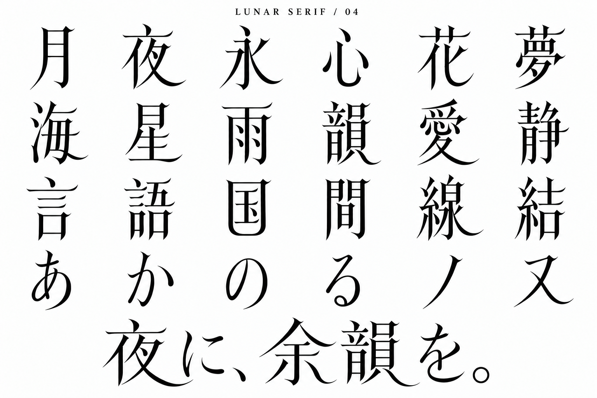

# LUNAR SERIF 04 — 独自字形の提案

内蔵imagegenで初稿、白地への補正、終筆の再設計の3回を実施。

## 目視評価

前の96字見本から、細身の字面、上向きに反る横画の終端、夜・愛・線の長い弧状の払い、国の丸い下辺、のの縦長の曲線へ変更。最終画像では言・語・雨の横画にも同じ反りが現れ、通常の三角ウロコより一貫した特徴が見える。明朝体の骨格は残るが、前案より見分けられるディスプレイ書体の方向になった。

これは生成画像による造形案。既存の全書体との非類似性を保証したものではなく、フォントファイルへの実装や全字形の正字検証は未実施。小さい本文サイズに適するかも未検証。

## プロンプト

### 初稿

Use case: logo-brand. Create a Japanese ORIGINAL DISPLAY TYPEFACE design specimen for LUNAR SERIF. This must look visibly custom-drawn, not like typeset conventional Mincho. White background black glyphs, landscape high resolution, sober type foundry specimen. Title small LUNAR SERIF / 04. Main grid 6 columns 4 rows, exactly these 24 characters:
月 夜 永 心 花 夢
海 星 雨 韻 愛 静
言 語 国 間 線 結
あ か の る ノ ヌ
DESIGN SYSTEM, applied consistently to actual stroke silhouettes: extremely tall and narrow glyph bodies (width about 65% of height), generous spaces between glyphs; vertical main strokes are elegantly curved tapered blades rather than straight rectangular Mincho stems; crossbars extremely fine and placed unusually high; eliminate ordinary triangular Mincho uroko, replace with tiny concave crescent-cut beak terminals; lower right sweeps long smooth thin crescents rising gently at the very end; short dots are pointed almond teardrops; enclosed forms 月日国門 have subtly bowed sides and rounded interior lower corners, not square boxes. Maintain recognizable correct Japanese stroke structures, no missing strokes, no stars or moons pasted onto characters, no stencil gaps, no fantasy runes. Quiet nocturnal, mature literary elegance, refined but NOTICEABLY experimental custom lettering. Don't simply condense an existing font: redesign contours, joins, terminals and interior space. Bottom a large phrase in exactly this same bespoke style: 夜に、余韻を。 No explanatory captions. All letters flat solid black, no gradients or texture.

### 白地への補正

Correct only the rendering colors of this specimen. Background must be pure solid WHITE #FFFFFF. Every glyph must be filled solid BLACK #000000, with no outline-only letters, no gray, no shadow, no texture, no lighting, no metallic effects. Preserve all existing custom tall narrow letter contours, crescent swept terminals, glyph positions, exact text and composition. It should look like opaque black vector ink on clean white paper, extremely legible high contrast. Crucial: fill the interior of each letter stroke black, retain counters white.

### 最終・終筆再設計

Refine this bespoke Japanese typeface specimen. Keep WHITE background, BLACK filled letters, exact 24 characters and bottom phrase, identical arrangement and slender proportions. Change ONLY the terminal design system throughout: replace ALL conventional solid triangular Mincho serifs at horizontal right ends with small elegantly upturned needle beaks having a clearly CONCAVE scooped underside, like a tapered curved thorn, not a triangular wedge. Apply subtle concave scoops to the tops of main vertical stems too. Maintain Japanese character recognition and all strokes. Preserve the beautiful rounded bottom of 国, long crescent sweeping tails of 夜 愛 線 and slender oval の. Do not add ornaments or isolated moons. These carved curved terminals must be plainly visible at this size yet delicate and consistent; this is a custom contemporary literary display family, not a stock Mincho. Flat crisp ink, no textures.
