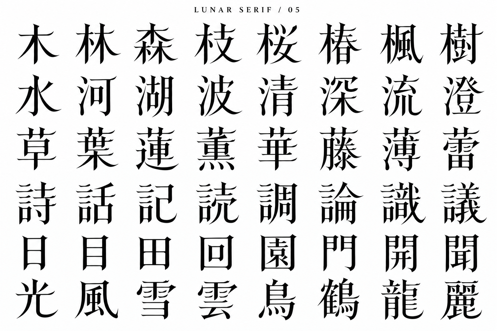

# LUNAR SERIF 05 — 漢字48字の追加見本

内蔵imagegenで04を参照して生成。

木偏、さんずい、草冠、言偏、囲み、複雑な字に展開。目視で48セルを確認。木・水・波の払い、葉・詩の横画の反りに04の特徴が引き継がれている。一方、囲みの丸みは04の国より控えめで、複雑な字は密度が上がる。画像上のデザイン案であり、細部の正字検証とフォントへの実装は未実施。

## 生成プロンプト

Create a NEW expanded kanji specimen of the EXACT custom LUNAR SERIF type design in the reference. Reference is aesthetic only; replace its text with 48 DIFFERENT characters below. Pure WHITE background, opaque BLACK filled strokes, no texture. Landscape high resolution. Small title LUNAR SERIF / 05. 8 columns by 6 rows, even generous spacing, no captions or footer. Exact rows:
木 林 森 枝 桜 椿 楓 樹
水 河 湖 波 清 深 流 澄
草 葉 蓮 薫 華 藤 薄 蕾
詩 話 記 読 調 論 識 議
日 目 田 回 園 門 開 聞
光 風 雪 雲 鳥 鶴 龍 麗
Match the reference's DISTINCTIVE contours consistently: tall narrow glyph bodies, delicate hairline horizontals with unmistakably upturned curved needle ends and concave undersides instead of ordinary triangular Mincho uroko; gently carved stem tops; long elegant crescent-shaped tapered right sweeps; almond teardrop dots; enclosed boxes have subtly rounded lower corners like reference 国. Preserve correct conventional Japanese character structures and strokes, even on complex 龍 鶴 議 藤. Optical adjustment of dense glyphs must maintain readability. This must look like the same bespoke family as reference, NOT conventional stock Mincho, NOT brush calligraphy. Do not add stars, crescents or ornaments as separate symbols. All 48 characters large, sharp, complete and centered in their cells.
