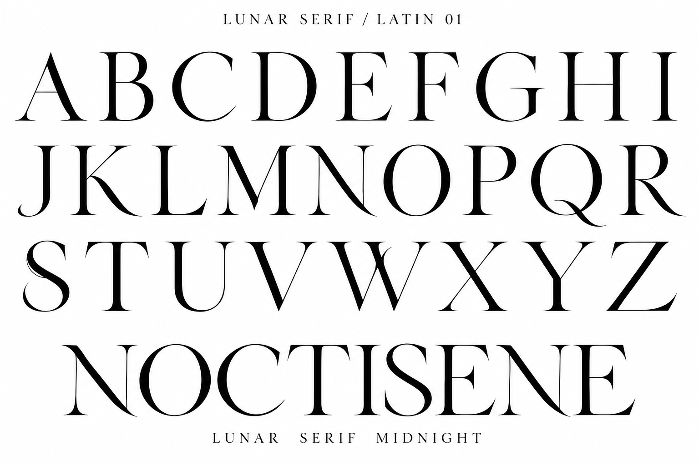

# LUNAR SERIF — Latin capitals

内蔵imagegenで原案01から欧文大文字を展開。

A–Zの26字とNOCTISENEの単語見本を目視確認。Nの流れる斜線、K・R・Qの曲線、E・L・Zの終端が特徴。Oは装飾のない通常字形。全体には伝統的な高コントラストセリフの要素も強く残っている。Sに細い二重線状の部分があり、輪郭化時には整理が必要。画像による提案であり既存フォントの更新ではない。

## 生成プロンプト

Create an original LUNAR SERIF uppercase Latin typeface development specimen. Input reference is the ORIGINAL brand concept: preserve its elegant high contrast, flowing diagonal N and narrow sinuous S, develop them coherently across ALL 26 CAPITALS. Pure WHITE background, solid BLACK filled glyphs. No textures. Landscape high resolution, clean foundry specimen. Small title LUNAR SERIF / LATIN 01.
Three generous rows of large individual capitals, exact text:
A B C D E F G H I
J K L M N O P Q R
S T U V W X Y Z
Every capital exactly once in these rows, same cap height, optically spaced. Bottom large word NOCTISENE, and below it smaller words LUNAR  SERIF  MIDNIGHT.
Design distinctive actual contours, not stock Didot: tall slender proportions; finely concave carved serif brackets ending in curved needles; gracefully curved tapering diagonals on N, M, K, R rather than mechanical straight strokes; crescent-like tapered curves on C G S Q; gently upturned lower terminals on E L Z; high fine crossbars, generous open counters. N's diagonal and R's leg finish in a long graceful sweep but never collide with neighbors. O must be plain narrow oval with thick sides and hairline top/bottom for text use; do NOT put stars or crescents INSIDE O in this specimen. Preserve standard legibility of every alphabet letter, no missing letters, no Cyrillic substitutions, no ligatures hiding individual letters. Restrained literary nocturnal elegance, precision drawn contours. The coherent alphabet is the main subject; do not copy the reference's giant logo layout, diagrams, numbers, Japanese text or black footer.
