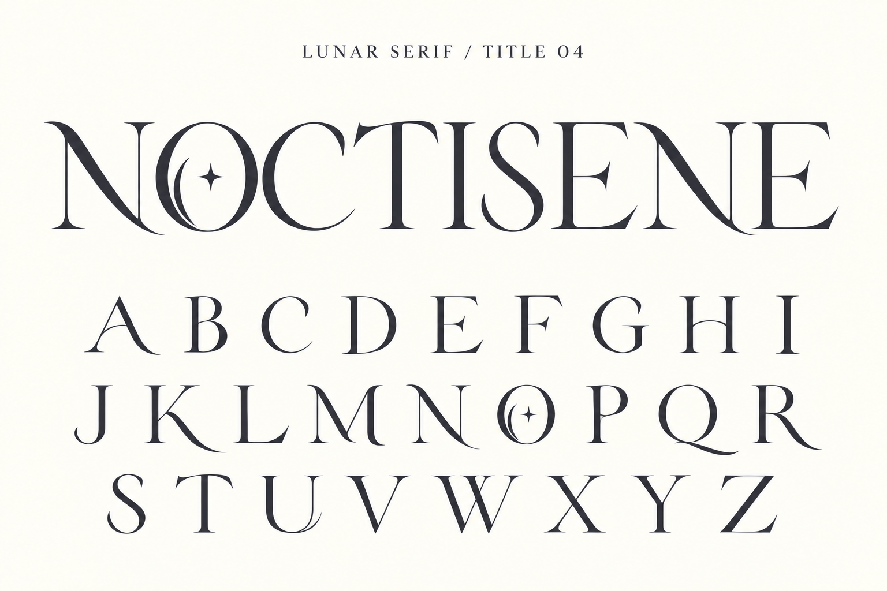

# Title 04 — 欧文全体の造形調整

内蔵imagegenで08を編集。Oの三日月と星を保持し、A・Hの湾曲した横棒、K・N・Q・Rの払い、Tの非対称の上辺、Eの終端を調整。画像で26字とNOCTISENEを確認。B・D・I等の変化は控えめ。フォント実装前の画像案。

## 生成プロンプト

Edit this LUNAR SERIF title specimen to make the OTHER letters as bespoke and stylish as O. Preserve O EXACTLY: narrow oval, inner left crescent and tiny four-point star, both in the word and alphabet. Preserve ivory background, charcoal ink, refined high contrast, exact NOCTISENE spelling and complete A-Z in three rows. Change heading to LUNAR SERIF / TITLE 04.
Actually redesign contours across the alphabet, clearly visible changes:
A: graceful rising curved crossbar and sweeping tapered right foot.
C: crescent-shaped curved pointed terminals.
E and F: gently curved middle arm finishing in a fine upward needle, NOT a circular spiral; E lower arm long and slightly upturned.
H: shallow arched hairline crossbar.
K and R: long curved tapering lower legs.
M and N: silky curved diagonals with gently extended swept feet. Keep N recognizable.
Q: long thin crescent tail sweeping underneath toward the right.
S: expressive narrow sinuous spine with gently inward tapering crescent tips.
T: shallow asymmetric arched top bar with pointed ends.
U: fine sweeping exit at lower right.
V W Y: subtle curved tapered diagonals.
L Z: gracefully rising lower terminals.
B D P: subtle inward carved joins and elegant teardrop counters.
Keep I and J delicately refined.
Apply the SAME redesigned N C T I S E in the large NOCTISENE title and alphabet below. All 26 letters complete, separated and readable. Elegant contemporary literary title typography, not plain conventional serif, not excessive curly calligraphy. No added stars or moons in other letters; their individuality comes from actual stroke geometry. No overlaps between neighboring letters, no decorative border.
