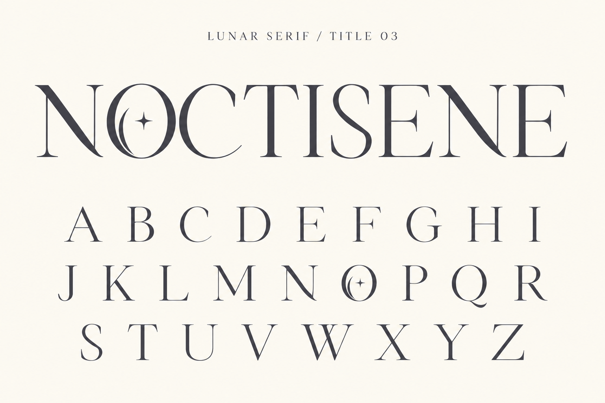

# Title 03 — 三日月と星のO

ユーザー添付のNOCTISENEを主参照として内蔵imagegenで生成。Oを巻き込みから三日月と四芒星へ戻し、Eの巻き込みと過剰な払いを抑制。画像上でNOCTISENEとA–Zの26字、両方のOのモチーフを確認。フォント未実装。

## プロンプト

Create a refined title typography specimen directly faithful to the attached user-approved NOCTISENE wordmark. The attachment is the PRIMARY design reference. Preserve its restrained elegance, airy fine strokes, narrow flowing serif letters and especially its distinctive O: a slim oval outer contour, a delicate crescent tucked along the inner LEFT side and one tiny four-point star at its optical center. NOT a spiral, NOT a curled ball terminal. Do not replace this motif. Keep N sweeping but restrained, E clean without curls, S slender. No excessive swashes.
Warm ivory background and charcoal lettering matching the reference. Landscape high resolution. Top small understated label "LUNAR SERIF / TITLE 03". Main upper half: a beautifully proportioned large NOCTISENE wordmark closely matching the attachment, enough clear margin, correctly spelled. The O must carry the crescent and tiny star.
Lower half: 26 individually spaced uppercase letters in three rows, in the same refined type design:
A B C D E F G H I
J K L M N O P Q R
S T U V W X Y Z
Use the same crescent-and-star O in the alphabet too. Keep all letters readable, one each, no extra motifs in other letters. Pay particular attention to delicate stroke contrast rather than bulky stems; retain enough charcoal weight for clear visibility. Flat clean typography, no mockup, no shadow, no illustration or extra captions. This is an elegant refinement faithful to the reference, not a flamboyant redesign.
