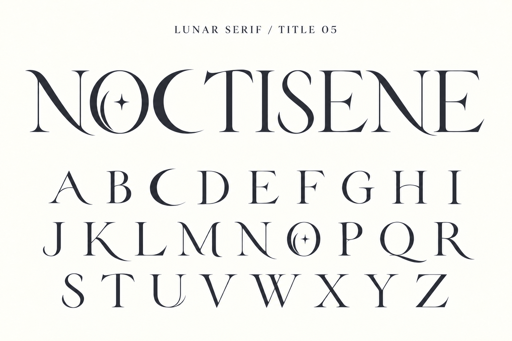

# Title 05 — 三日月のC

内蔵imagegenで09のCを修正。ロゴと一覧の両方で、深くえぐった内側と尖った上下端を持つ三日月状のCを目視確認。Oの三日月と星も保持。画像案でありフォント未実装。

## プロンプト

Edit this typography specimen with a focused change: redesign BOTH instances of capital C (in NOCTISENE and in the A-Z row) as an unmistakable elegant CRESCENT MOON letter. Use a fuller convex left outer curve and deeply scooped offset inner curve, creating a crescent silhouette with two long needle-sharp horns pointing to the upper right and lower right. Remove the conventional serif/beak at the top of C entirely. It should read both as letter C and as a slim crescent moon, visibly different from the existing standard serif C. Keep its optical weight balanced with O and keep the open right aperture very clear. Preserve ALL other letters exactly, especially O's inner crescent and tiny four-point star, all text, spacing, ivory background and charcoal color. No extra standalone moons or stars. Change small heading from TITLE 04 to TITLE 05. Flat precise filled typography.
