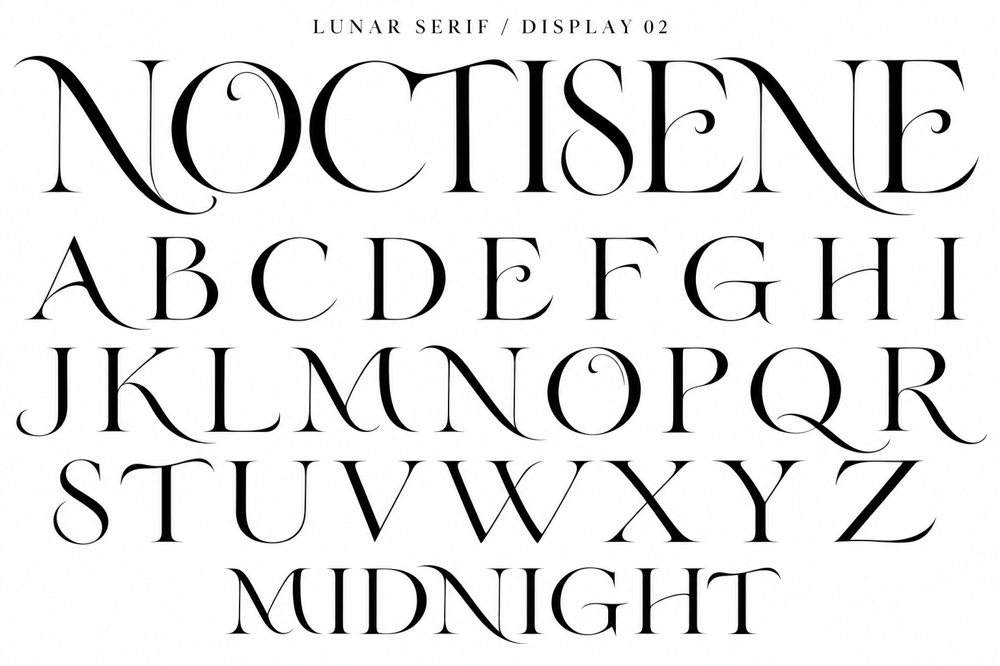

# LUNAR SERIF — Title Display 02

内蔵imagegenで欧文06を参照し、追加のタイトル用バリエーションを生成。既存見本は保持。

## 目視確認

A–Zの26字、NOCTISENE、MIDNIGHTを確認。Nの長い払い、Oの内側の巻き込み、Eの丸まる中腕、Tの弧状の横棒、A・Hの曲線的な横棒に通常版との差が出た。タイトルや表紙向けの造形案。NOCTISENEのCとTは上部で接近・接続して見えるため、フォント化する際は独立字形とタイトル専用の組みを分けて検討する。先頭と後方のNには払いの差がある。フォント実装・小サイズでの可読性検証は未実施。

## 生成プロンプト

Create a NEW, noticeably more fashionable and expressive TITLE DISPLAY companion to the attached LUNAR SERIF alphabet. Reference is family DNA only, not a layout to copy. Design an exquisite contemporary editorial masthead typeface with a subtle Art Nouveau influence. White background, crisp solid black lettering, no gradients, no textures, no mockup objects. Landscape high resolution.
Tiny heading "LUNAR SERIF / DISPLAY 02".
Top 40 percent: very large title exactly "NOCTISENE", perfectly readable, luxurious bespoke lettering. Flowing curved N diagonal extends gracefully below baseline, oval O with a fine inward curled terminal integrated into its contour (no star), C with elegant sharp crescent tips, T with gently arched asymmetric crossbar, narrow sensuous S, E with fine curling middle arm and upturned lower arm. Contrast bold silky main strokes with fine hairlines; generous negative space. Allow a few delicate swash extensions but no tangled collisions. This must be visibly more expressive and original than the restrained reference, suitable for an album title or literary magazine cover, not generic Didot.
Middle: all uppercase glyphs individually, same display design in three spacious rows:
A B C D E F G H I
J K L M N O P Q R
S T U V W X Y Z
Every alphabet letter once, all recognizable. A has a curved crossbar, K and R have elegant long curved legs, Q an open sweeping tail, M and W subtly curved diagonals. Keep typographic family consistent.
Bottom: medium sized word "MIDNIGHT" using this same title face.
Do not add Japanese, explanatory captions, ornaments, illustrations, stars, duplicated specimen rows, or extra words. Craft actual distinctive letter silhouettes, not decoration around conventional type.
