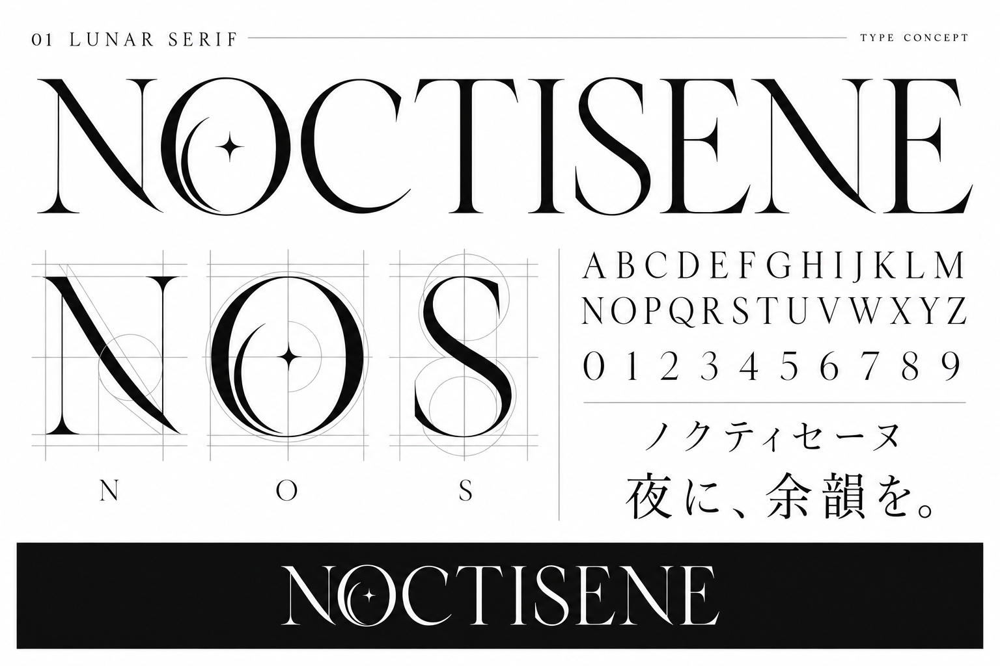

# NOCTISENE フォント案

2026-09-13。内蔵 image_gen で生成したデザイン見本。TTF/OTFではありません。字形・文字セットの整合性は実フォント制作時に調整します。

## 01 LUNAR SERIF

### Initial prompt

Use case: logo-brand. Create one polished original custom typeface CONCEPT SPECIMEN image for NOCTISENE, a five-member mature mysterious cool female music unit whose world is nocturnal city, literary intimacy, intellectual restraint, moonlit elegance, quiet strength. This is type design exploration, not a finished font file. Portrait landscape 3:2 specimen board with generous whitespace and impeccably clear lettering. Make the custom glyph construction the subject, no people, no photography, no generic stock font mockup, no fake 3D. Large exact word "NOCTISENE" spelled N O C T I S E N E as hero at upper third. Show coherent alphabet "ABCDEFGHIJKLMNOPQRSTUVWXYZ" split into readable rows, numerals "0123456789", and Japanese sample "ノクティセーヌ" and "夜に、余韻を。" in a compatible original Japanese design. Bottom small inverse-color strip repeats NOCTISENE to demonstrate one-color usability. Glyphs must share a rational consistent stroke system so this can inspire a real font; keep all text inside generous margins. Do not add extra copy beyond concept title, samples and tiny "TYPE CONCEPT".  Concept title exactly "01 LUNAR SERIF". Direction: An original elegant high-contrast literary serif, slender elongated verticals, gently flared razor-fine terminals, distinctive crescent-shaped inner counters of C/O, slightly curved N diagonal, restrained swept leg of R. NOT generic Roman inscription capitals. Quiet luxury and intimacy, sophisticated readable sharp letter silhouettes. Ivory background, ink-black glyphs, one subtle amethyst fine rule. Japanese has airy refined mincho construction. Enlarge N O S as three construction detail examples with subtle hairline guides. Strong hierarchy, editorial type foundry specimen.

### Contrast correction prompt

Keep exactly the custom typeface shapes, all wording and layout of this specimen board. Correct only colors and legibility. Replace the entire cloudy dark background with a completely solid flat opaque WHITE #FFFFFF background. All primary letters and samples must be solid opaque BLACK #111111 with extremely strong contrast. Secondary rules light grey. The bottom strip alone solid black with white lettering. Absolutely NO gradients, glow, haze, shadows, metallic effects, vignette, texture, translucency, dark overlays or low-contrast text. This is a crisp printed black ink on white paper typography specimen, perfectly readable. Preserve concept 01 LUNAR SERIF.

